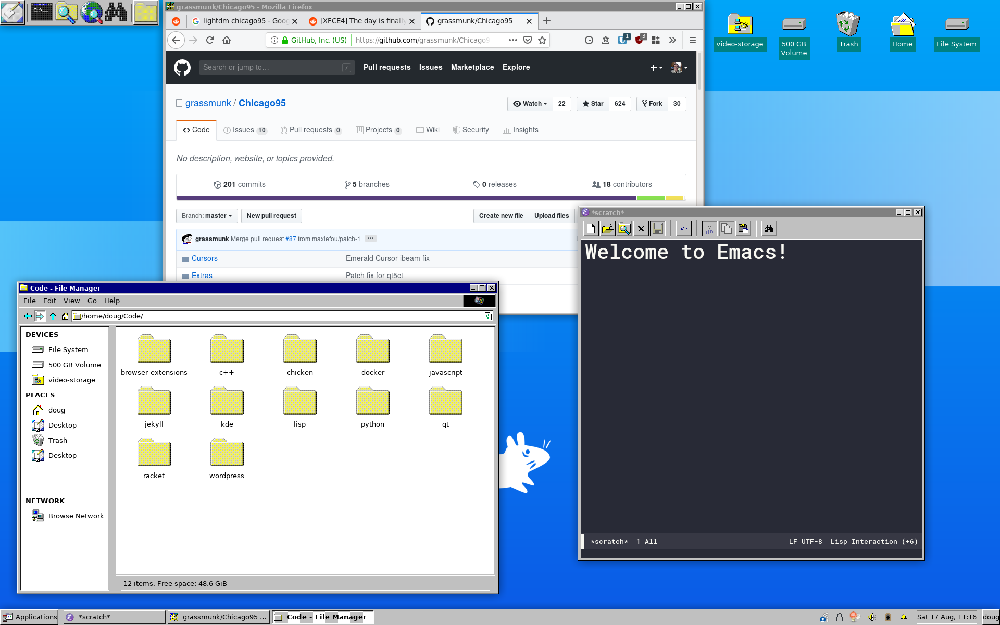

XFCE-Dotfiles by Doug Beney
---

Requirements:

- [Chicago95](https://github.com/grassmunk/Chicago95)

Arch Linux notes:

- `yay -Sy xfce4 xfce4-goodies xcursor-chicago95-git chicago95-icon-theme-git chicago95-gtk-theme-git`
